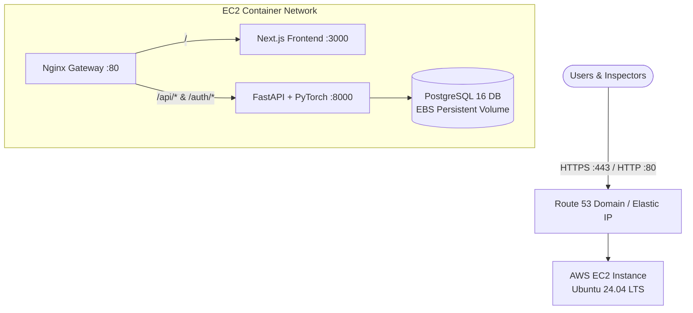

# ☁️ Complete AWS Deployment Guide - VisionInspect AI

This guide walks you step-by-step through deploying the **VisionInspect AI Quality Inspection System** onto **Amazon Web Services (AWS)**.

---

## 🎯 Recommended Method: AWS EC2 with Docker Compose
*Best for simplicity, cost efficiency ($15–$30/month), and 100% parity with your local Docker Compose setup.*



---

## 📋 Step-by-Step EC2 Deployment Walkthrough

### Step 1: Launch an AWS EC2 Instance
1. Log in to the [AWS Management Console](https://console.aws.amazon.com/ec2/).
2. Navigate to **EC2** > **Instances** > click **Launch Instance**.
3. Configure the following instance details:
   - **Name:** `visioninspect-production`
   - **OS (AMI):** `Ubuntu Server 24.04 LTS (HVM), SSD Volume Type` (64-bit x86 or ARM)
   - **Instance Type:** 
     - **Recommended:** `t3.medium` (2 vCPU, 4 GB RAM) or `t3.large` (2 vCPU, 8 GB RAM) to smoothly handle Next.js builds, PyTorch CNN inference, and PostgreSQL.
   - **Key Pair:** Create a new key pair or select an existing one (e.g., `visioninspect-key.pem`). Download and save it securely.
   - **Network & Security Group:**
     - Enable **Allow SSH traffic** from `Anywhere` (or your IP).
     - Enable **Allow HTTP traffic from the internet** (Port 80).
     - Enable **Allow HTTPS traffic from the internet** (Port 443).
     - Add custom TCP rule for Port 8000 or 3000 *only if you want direct access without Nginx*.
   - **Storage (EBS):** Set root volume to **30 GB gp3** (allows room for Docker images and defect image storage).
4. Click **Launch Instance**.

---

### Step 2: Assign an Elastic IP (Static Public IP)
*This ensures your server IP doesn't change when restarted.*
1. In EC2 Console, go to **Network & Security** > **Elastic IPs**.
2. Click **Allocate Elastic IP address** > **Allocate**.
3. Select the allocated IP > Click **Actions** > **Associate Elastic IP address**.
4. Choose your `visioninspect-production` instance and associate it.
5. Note down your Elastic IP (e.g., `54.210.xx.xx`).

---

### Step 3: Connect to Your EC2 Server
On your local machine terminal:
```bash
# Set secure permissions for your private key
chmod 400 visioninspect-key.pem

# Connect via SSH (replace 54.210.xx.xx with your Elastic IP)
ssh -i visioninspect-key.pem ubuntu@54.210.xx.xx
```

---

### Step 4: Install Docker & Docker Compose on EC2
Run this one-line setup script on your EC2 instance:
```bash
# Update packages
sudo apt-get update && sudo apt-get upgrade -y

# Install Docker dependencies
sudo apt-get install -y ca-certificates curl gnupg lsb-release git

# Add Docker's official GPG key & repository
sudo mkdir -p /etc/apt/keyrings
curl -fsSL https://download.docker.com/linux/ubuntu/gpg | sudo gpg --dearmor -o /etc/apt/keyrings/docker.gpg
echo "deb [arch=$(dpkg --print-architecture) signed-by=/etc/apt/keyrings/docker.gpg] https://download.docker.com/linux/ubuntu $(lsb_release -cs) stable" | sudo tee /etc/apt/sources.list.d/docker.list > /dev/null

# Install Docker Engine and Docker Compose Plugin
sudo apt-get update
sudo apt-get install -y docker-ce docker-ce-cli containerd.io docker-compose-plugin

# Enable Docker without sudo for ubuntu user
sudo usermod -aG docker $USER
newgrp docker
```

---

### Step 5: Clone Repository & Configure Environment
```bash
# Clone the repository
git clone <YOUR_GITHUB_REPO_URL> /opt/quality-inspection-system
cd /opt/quality-inspection-system

# Create .env from template
cp .env.example .env
```

Generate secure production secrets for `.env`:
```bash
# Generate a JWT Secret:
openssl rand -hex 32

# Generate a Database Password:
openssl rand -hex 16
```

Edit the `.env` file (`nano .env`):
```env
APP_NAME="VisionInspect AI"
ENVIRONMENT=production

# Database
POSTGRES_USER=visioninspect
POSTGRES_PASSWORD=<PASTE_YOUR_GENERATED_DB_PASSWORD>
POSTGRES_DB=visioninspect
POSTGRES_PORT=5432

# Security
JWT_SECRET_KEY=<PASTE_YOUR_GENERATED_JWT_SECRET>
JWT_ALGORITHM=HS256
ACCESS_TOKEN_EXPIRE_MINUTES=120

# Ports & Gateway
GATEWAY_PORT=80
FRONTEND_PORT=3000
API_PORT=8000

# Client API URL
# If using direct IP: http://54.210.xx.xx
# If using a custom domain: https://inspection.yourcompany.com
NEXT_PUBLIC_API_URL=http://54.210.xx.xx

CORS_ORIGINS=["*"]
```

---

### Step 6: Build & Launch the Application
```bash
# Build and run all containers in background
docker compose up --build -d
```

Check running container status:
```bash
docker compose ps
```

---

### Step 7: Seed Initial Administrator Account
Seed the default roles and your production admin user:
```bash
docker compose exec backend python -m app.services.seed \
  --admin-email "admin@yourcompany.com" \
  --admin-full-name "Quality Admin" \
  --admin-password "YourSecurePassword#2026"
```

You can now open your browser and navigate to:
👉 **`http://<YOUR_ELASTIC_IP>`**

---

### Step 8: (Optional) Set up Domain & Free SSL (HTTPS) with Certbot

If you have a domain (e.g. `inspection.yourdomain.com` pointing to your Elastic IP in Route 53 or Cloudflare):

1. Install Certbot on EC2:
```bash
sudo apt-get install -y certbot python3-certbot-nginx
```

2. Temporarily stop Docker gateway port 80:
```bash
docker compose stop nginx
```

3. Obtain Let's Encrypt Certificate:
```bash
sudo certbot certonly --standalone -d inspection.yourdomain.com
```

4. Place your certificates in `/etc/letsencrypt/live/inspection.yourdomain.com/` and mount them into `docker-compose.yml` or run Nginx on the host server:
```bash
# Host Nginx configuration:
sudo apt-get install -y nginx
sudo nano /etc/nginx/sites-available/visioninspect.conf
```
Add:
```nginx
server {
    listen 80;
    server_name inspection.yourdomain.com;
    return 301 https://$host$request_uri;
}

server {
    listen 443 ssl;
    server_name inspection.yourdomain.com;

    ssl_certificate /etc/letsencrypt/live/inspection.yourdomain.com/fullchain.pem;
    ssl_certificate_key /etc/letsencrypt/live/inspection.yourdomain.com/privkey.pem;

    client_max_body_size 50M;

    location / {
        proxy_pass http://127.0.0.1:80; # Forwards to Docker Nginx gateway
        proxy_set_header Host $host;
        proxy_set_header X-Real-IP $remote_addr;
        proxy_set_header X-Forwarded-For $proxy_add_x_forwarded_for;
        proxy_set_header X-Forwarded-Proto https;
    }
}
```
Enable and restart Nginx:
```bash
sudo ln -s /etc/nginx/sites-available/visioninspect.conf /etc/nginx/sites-enabled/
sudo systemctl restart nginx
docker compose start nginx
```

---

## 🚀 Alternative: Enterprise Multi-Tier AWS Architecture (ECS + RDS + S3 + ALB)

For high-scale auto-scaling environments:

| Component | AWS Managed Service | Purpose |
| :--- | :--- | :--- |
| **Frontend & Backend** | **AWS ECS (Fargate)** | Serverless container execution with auto-scaling |
| **Container Images** | **AWS ECR (Elastic Container Registry)** | Private Docker registry for frontend, backend, nginx images |
| **Database** | **AWS RDS (PostgreSQL 16)** | Managed PostgreSQL with automated backups & failover |
| **Image Storage** | **AWS S3** | Durable object storage for uploaded defect inspection images |
| **SSL & Load Balancing** | **AWS ALB + AWS Certificate Manager (ACM)** | HTTPS termination with free auto-renewing SSL certs |
| **DNS** | **AWS Route 53** | Domain routing to ALB |

---

## 🛠️ Essential Maintenance Commands on AWS

```bash
# View live logs
docker compose logs -f

# Rebuild after pulling latest code from git
git pull origin main
docker compose up --build -d

# Backup PostgreSQL Database
docker compose exec -T db pg_dump -U visioninspect visioninspect > ~/backup_$(date +%F).sql

# Restore PostgreSQL Database
docker compose exec -T db psql -U visioninspect -d visioninspect < ~/backup_2026-09-06.sql
```
