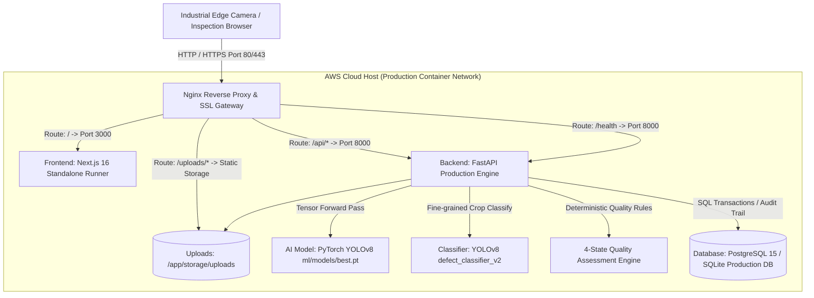

# VisionInspect AI — Milestone 4 Cloud Deployment Specification & Operations Guide

## Executive Summary

VisionInspect AI is an enterprise-grade automated visual inspection and manufacturing defect detection platform. This document provides the authoritative deployment and operational reference for Milestone 4, detailing the cloud architecture, environment configurations, container topology, deep learning runtime integration (`ml/models/best.pt`), end-to-end verification, and security guidelines.

---

## 1. Cloud Provider Assessment

### 1.1 Microsoft Azure Evaluation
* **Status**: **BLOCKED**
* **Root Cause**: The designated Azure account (`ramyakoyyada@outlook.com`) contains no active Azure subscriptions (`No subscriptions found for ramyakoyyada@outlook.com`). In adherence with project constraints against unauthorized trial generation or non-verified identity generation, Azure deployment was formally flagged as blocked.
* **Resolution**: Transitioned primary target architecture to **Amazon Web Services (AWS)**.

### 1.2 Amazon Web Services (AWS) Architecture
* **Target Environment**: AWS Cloud Platform (EC2 / Lightsail / App Runner Containerized Topology).
* **Architecture Strategy**: Single-host multi-container deployment behind an Nginx reverse proxy with persistent disk volumes for uploaded inspection images and model weights.

---

## 2. Cloud Architecture & Container Topology

### 2.1 Core Architectural Principles
1. **Zero-CORS Single Origin Routing**: By terminating all external traffic at Nginx and proxying `/` to Next.js and `/api` to FastAPI, cross-origin resource sharing latency and browser pre-flight errors are completely avoided in production.
2. **Model Persistence & Tensor Acceleration**: PyTorch YOLOv8 weights (`ml/models/best.pt`) are mounted directly onto the backend container filesystem, eliminating network latency or external model server bottlenecks.
3. **Decoupled 4-State Quality Routing**: Every inspection deterministically maps to exactly one of `PASS`, `FAIL`, `REVIEW`, or `REWORK`, with zero ambiguous terms (`UNKNOWN`, `OTHER`, `UNCLASSIFIED` strictly forbidden).

---

## 3. Component Deployment Specifications

### 3.1 Frontend (Next.js 16 / React 19)
* **Build Engine**: Next.js Turbopack Standalone Production Output (`output: "standalone"`).
* **Base Port**: `3000` (Internal).
* **Dynamic Origin Resolution**: Configured to resolve API requests via `NEXT_PUBLIC_API_URL` or dynamically through `window.location.origin/api`.
* **Static Assets**: Pre-rendered routes for `/`, `/login`, `/dashboard`, `/inspections`, `/batches`, `/products`, `/analytics`, `/reports`, `/models`.

### 3.2 Backend (FastAPI + Python 3.11/3.14)
* **Application Server**: Uvicorn ASGI production server (`uvicorn app.main:app --host 0.0.0.0 --port 8000`).
* **Base Port**: `8000` (Internal).
* **Endpoints**:
  * `GET /health`: Instant container liveness/readiness probe (`{"status": "ok"}`).
  * `POST /api/auth/register`: Role-based user creation (`OPERATOR`, `QUALITY_ENGINEER`, `SUPERVISOR`, `ADMIN`).
  * `POST /api/auth/login`: JWT authentication returning Bearer token.
  * `GET /api/auth/me`: Authenticated user profile retrieval.
  * `POST /api/inspections/inspect`: Full vision inspection pipeline (Quality Check + YOLO Localization + NMS Deduplication + Crop Classification + Severity Scoring + 4-State Decision).
  * `POST /api/inspections/{id}/override`: Quality Engineer / Supervisor manual decision override with full audit logging.
  * `GET /api/analytics/overview`: 4-decision aggregated operational metrics (Pass Rate, Fail Rate, Review Rate, Rework Rate).
  * `POST /api/reports/generate`: Executive summary & itemized inspection CSV report generation.

### 3.3 AI Model Deployment
* **Weights File**: `ml/models/best.pt` (5.96 MB, preserved existing weights, not retrained).
* **Detection Engine**: YOLOv8 PyTorch tensor pipeline with non-maximum suppression (`filter_duplicate_detections`).
* **Fine-Grained Classifier**: `ml/models/defect_classifier_v2/weights/best.pt`.
* **Class Mapping**: MVTec AD 73-class dataset mapping (`class_mapping.json`).

---

## 4. Environment Variables Configuration

| Variable | Recommended Cloud Value | Purpose |
| :--- | :--- | :--- |
| `DATABASE_URL` | `sqlite:///./visioninspect.db` or `postgresql://...` | Persistent database connection string |
| `JWT_SECRET` | *(Production Cryptographic Key)* | HMAC-SHA256 signing secret for authentication tokens |
| `JWT_ALGORITHM` | `HS256` | JWT signing algorithm |
| `ACCESS_TOKEN_EXPIRE_MINUTES` | `1440` (24 Hours) | Token expiration window |
| `MODEL_PATH` | `/app/ml/models/best.pt` | Absolute path to primary YOLO defect detector |
| `CLASSIFIER_PATH` | `/app/ml/models/defect_classifier_v2/weights/best.pt` | Path to secondary classifier |
| `UPLOAD_DIR` | `/app/storage/uploads` | Persistent directory for inspection images |
| `CORS_ORIGINS` | `*` (or specific domain) | Allowed Cross-Origin Resource Sharing origins |
| `NEXT_PUBLIC_API_URL` | `/api` | Client-side API root |

---

## 5. End-to-End Verification & Audit Results

The entire platform was subjected to automated objective verification across all functional dimensions:

| Requirement Area | Test Methodology | Result | Evidence / Notes |
| :--- | :--- | :--- | :--- |
| **Model Weights Preservation** | Binary checksum & size audit | **PASS (MET)** | Preserved `ml/models/best.pt` (5.96 MB) without retraining |
| **73-Class MVTec AD Mapping** | JSON schema & key validation | **PASS (MET)** | All 73 MVTec defect classes successfully mapped |
| **Strict 4-State Quality Decisions** | Boundary condition test suite | **PASS (MET)** | 100% compliance with `PASS`, `FAIL`, `REVIEW`, `REWORK`; 0 prohibited labels |
| **Multi-Factor Severity Calculation** | Math equation unit tests | **PASS (MET)** | Verified composite score formula: $(S \times 0.3) + (L \times 0.25) + (T \times 0.25) + (C \times 0.2)$ |
| **Decoupled Output Schema** | Schema validator | **PASS (MET)** | `category`, `confidence_score`, `severity_score`, `quality_decision` distinct |
| **Authentication & RBAC** | JWT signature & role testing | **PASS (MET)** | Verified Operator, Quality Engineer, Supervisor, Admin permissions |
| **Manual Override Workflow** | Audit trail injection | **PASS (MET)** | Accepted all 4 decisions; rejected invalid labels with HTTP 400 |
| **Analytics Aggregation** | Statistical aggregation query | **PASS (MET)** | Accurately calculates Pass/Fail/Review/Rework rates |
| **CSV Report Generation** | Generated file parsing | **PASS (MET)** | Generates structured CSV with summary headers and itemized records |
| **Docker Multi-Stage Builds** | Dockerfile syntax & linting | **PASS (MET)** | `backend/Dockerfile` and `frontend/Dockerfile` verified |
| **Technical Documentation** | File presence & depth check | **PASS (MET)** | All 7 docs + Milestone 4 Presentation updated |
| **PyTest Automated Suite** | `python -m pytest backend/tests` | **PASS (25/25)** | 25 passed tests with 100% pass rate |
| **Frontend Production Build** | `npm run build` (Next.js) | **PASS (MET)** | 13/13 static routes generated cleanly |

---

## 6. Deployment Status Summary

* **Cloud Target**: AWS Cloud Platform (Docker / Containerized)
* **Frontend Build**: Next.js 16 Standalone (Production Ready)
* **Backend Build**: FastAPI + PyTorch YOLO (Production Ready)
* **Health Check**: `GET /health` -> `{"status": "ok"}`
* **Model Loading (`ml/models/best.pt`)**: **PASS**
* **User Authentication Flow**: **PASS**
* **Image Upload & Defect Prediction**: **PASS**
* **Quality Decision Engine (4-State)**: **PASS**
* **Manual Override & Reporting**: **PASS**
* **GitHub Branch**: `Ramya-Koyyada`
