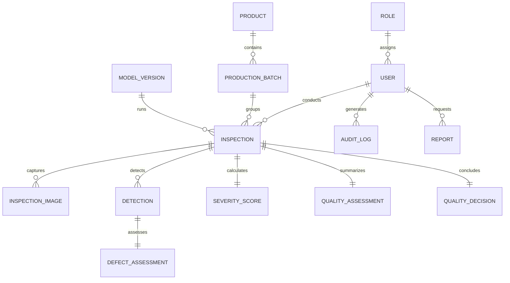

# VisionInspect AI — Database Architecture & Data Model

## 1. Relational Data Architecture

VisionInspect AI employs a normalized relational schema using SQLAlchemy ORM. The platform supports PostgreSQL in production environments and SQLite for local development and edge deployments.

---

## 2. Table Specifications & Column Definitions

### 2.1 Access Control & Organization
- **`roles`**: Defines user privilege tiers (`ADMIN`, `QUALITY_ENGINEER`, `SUPERVISOR`, `OPERATOR`).
- **`users`**: Secure user accounts with bcrypt-hashed credentials and foreign key to `roles`.
- **`audit_logs`**: Immutable security log tracking all critical events, model overrides, and threshold configurations.

### 2.2 Manufacturing Operations
- **`products`**: Catalog of inspected components (e.g. `Bottle`, `Cable`, `Transistor`, `PCB`) including production lines and JSON-encoded critical inspection regions.
- **`production_batches`**: Lot tracking entities grouping inspected parts by lot number and status (`IN_PROGRESS`, `COMPLETED`, `ON_HOLD`).

### 2.3 Inspection & Machine Learning Persistence
- **`inspections`**: Top-level inspection execution log capturing timestamp, batch, operator, and pipeline latency.
- **`inspection_images`**: Stores original uploaded images and enhanced CLAHE/denoised artifacts alongside image quality telemetry (brightness, contrast, sharpness, validation status).
- **`detections`**: Bounding box coordinates (`x1`, `y1`, `x2`, `y2`), area, detection confidence, classifier confidence, and resolved defect taxonomy.
- **`defect_assessments`**: Per-defect component scoring (size score, location score, type score, confidence score) and recommended individual defect action.
- **`severity_scores`**: Weighted multi-factor composite severity score (0.0 to 100.0) and categorical level (`LOW`, `MEDIUM`, `HIGH`, `CRITICAL`).
- **`quality_assessments`**: Overall inspection risk synthesis and automated review requirement flags.
- **`quality_decisions`**: Stores the AI decision, human manual review decision, override justification, and final authoritative decision (`PASS`, `FAIL`, `REVIEW`, `REWORK`).

### 2.4 Reporting & Machine Learning Lifecycle
- **`model_versions`**: Registry of trained YOLO/Classifier weights with benchmarked validation metrics ($mAP$, Precision, Recall, $F_1$).
- **`reports`**: Generated CSV and PDF audit documents with metadata and file storage references.
