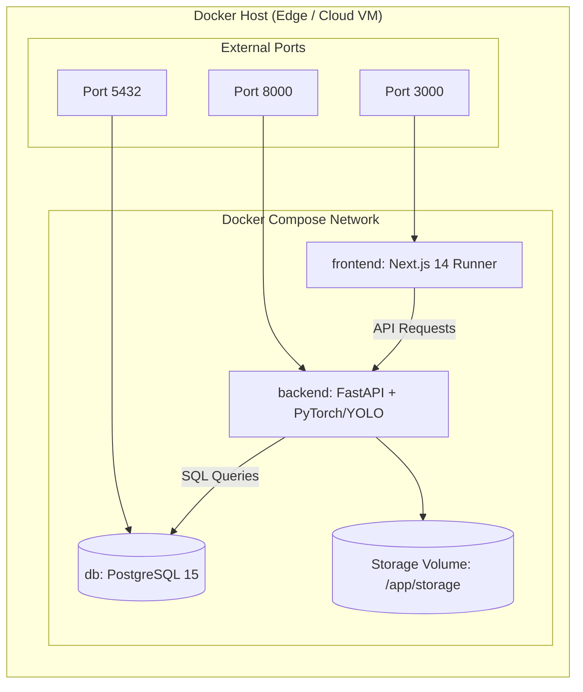

# VisionInspect AI — Deployment & Operations Guide

## 1. Containerized Deployment with Docker Compose

VisionInspect AI provides a multi-container deployment architecture comprising PostgreSQL 15, FastAPI backend, and Next.js 14 frontend.



### Quickstart Command

```bash
# Build and launch all services in detached mode
docker-compose up -d --build

# Verify container health
docker-compose ps
```

---

## 2. Environment Variables Configuration

| Variable | Default Value | Description |
| :--- | :--- | :--- |
| `DATABASE_URL` | `postgresql://vision_user:vision_password@db:5432/visioninspect` | SQLAlchemy database connection string |
| `JWT_SECRET` | `supersecretjwtkey_for_visioninspect_ai_project_in_production` | Cryptographic secret for JWT authentication tokens |
| `JWT_ALGORITHM` | `HS256` | JWT signing algorithm |
| `ACCESS_TOKEN_EXPIRE_MINUTES` | `1440` (24 hours) | Token validity window |
| `MODEL_PATH` | `/app/ml/models/best.pt` | Path to primary YOLO detector weights |
| `CLASSIFIER_PATH` | `/app/ml/models/defect_classifier_v2/weights/best.pt` | Path to secondary fine-grained classifier weights |
| `UPLOAD_DIR` | `/app/storage/uploads` | Persistent directory for uploaded inspection images |
| `NEXT_PUBLIC_API_URL` | `http://localhost:8000/api` | Client-accessible backend API base URL |

---

## 3. Production Hardening & Edge Deployments

### 3.1 Edge Industrial PC / NVIDIA Jetson
- **GPU Acceleration**: Mount NVIDIA runtime with `--gpus all` in Docker Compose to leverage TensorRT / CUDA cores.
- **Local Fallback**: SQLite fallback database is built-in if external PostgreSQL is unavailable at edge stations.
- **Offline Operation**: The entire vision inference pipeline operates self-contained without external cloud internet requirements.

### 3.2 High Availability & Orchestration
- **FastAPI Workers**: In production, launch Uvicorn with multiple workers (`uvicorn app.main:app --workers 4 --host 0.0.0.0 --port 8000`).
- **Database Migrations**: Alembic automatically runs on startup or via `alembic upgrade head`.
- **Healthcheck & Monitoring**:
  - Endpoint `GET /health` provides instant status checks for container restarts and Kubernetes readiness probes.
