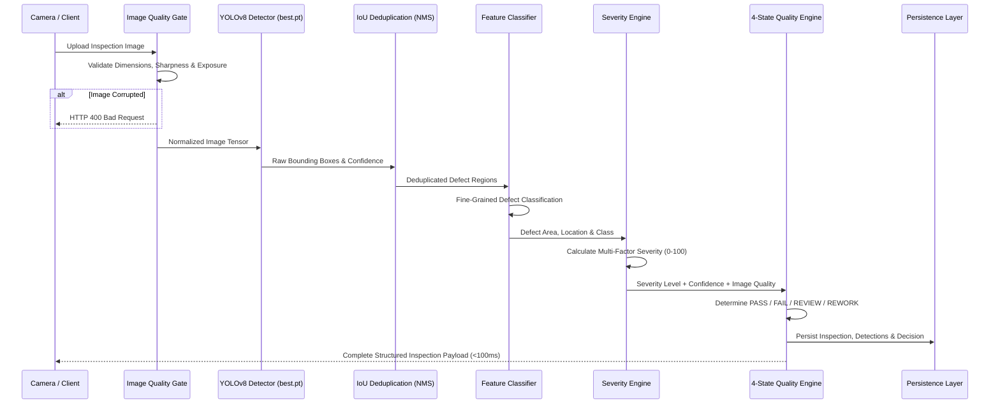

# VisionInspect AI — Machine Learning & Quality Decision Pipeline

## 1. End-to-End Inference Architecture

The VisionInspect AI inference pipeline executes a high-speed multi-stage inspection flow designed for deterministic, sub-100ms execution on edge manufacturing lines.

---

## 2. Pipeline Stages

### Stage 1: Image Validation & Quality Gate
- **Dimension & Format Checks**: Verifies dimensions (16px to 12,000px) and extensions (`.jpg`, `.png`, `.webp`).
- **Telemetry Extraction**: Evaluates Laplacian variance ($Var(\Delta I)$) for sharpness and pixel luminosity for exposure.
- **Quality Alerting**: Flags `POOR` quality images for mandatory human review (`REVIEW`).

### Stage 2: YOLO Defect Localization
- **Deep Learning Model**: YOLOv8 architecture optimized for defect localization.
- **IoU Deduplication**: Non-Maximum Suppression with intersection-over-union threshold ($IoU \ge 0.45$) to eliminate duplicate box detections over the same defect anomaly.

### Stage 3: Fine-Grained Defect Classification
- Dynamic bounding box crop with 15% context margin.
- Multi-category secondary classifier disambiguates fine-grained manufacturing defects (e.g. `broken_large` vs `broken_small`, `bent_wire` vs `spliced_lead`).
- Resolves candidate class against `class_mapping.json` (73 registered MVTec defect classes).

### Stage 4: Multi-Factor Severity Scoring
Severity is calculated through a deterministic multi-factor weighted formula:

$$\text{Total Severity Score} = (\text{Size Score} \times 0.30) + (\text{Location Score} \times 0.25) + (\text{Type Score} \times 0.25) + (\text{Confidence Score} \times 0.20)$$

- **Size Score (30%)**: Scaled logarithmically based on defect area relative to product dimensions.
- **Location Score (25%)**: Prioritizes central functional regions ($85-100$) over non-critical margins ($30-50$).
- **Type Score (25%)**: Defect criticality weighting:
  - Critical structural defects (`broken`, `hole`, `crack`, `missing`): $95$
  - Functional flaws (`short`, `spliced`, `frayed`): $80$
  - Surface blemishes (`scratch`, `spot`, `stain`, `glue`): $40-60$
- **Confidence Score (20%)**: Direct model prediction certainty.

### Severity Classification Thresholds
- **`CRITICAL`**: Score $\ge 75.0$
- **`HIGH`**: Score $\ge 50.0$ and $< 75.0$
- **`MEDIUM`**: Score $\ge 25.0$ and $< 50.0$
- **`LOW`**: Score $< 25.0$

---

## 3. Strict 4-State Quality Decision Engine

Every inspection deterministically outputs strictly one of four standardized quality decisions:

| Quality Decision | Manufacturing Meaning | Trigger Conditions |
| :--- | :--- | :--- |
| **`PASS`** | Meets all quality acceptance criteria | Zero defects detected; clean product. |
| **`FAIL`** | Unacceptable flaw; reject component | Fatal/uncorrectable defect (e.g. `broken`, `crack`, `hole`, `missing`, `split`) or `CRITICAL` severity level. |
| **`REVIEW`** | Ambiguous; requires human operator review | Detection confidence $< 70\%$, classifier confidence $< 60\%$, or image quality evaluated as `POOR`. |
| **`REWORK`** | Correctable defect; route to rework station | Reworkable/repairable defect (e.g. `scratch`, `contamination`, `bent`, `misplaced`, `spot`, `glue`, `fabric_border`) with acceptable confidence and non-critical severity. |

> [!IMPORTANT]
> Prohibited decision labels (`UNKNOWN`, `OTHER`, `UNCLASSIFIED`, `LOW CONFIDENCE CLASSIFICATION`, `MANUAL REVIEW`, `REJECT`, `APPROVED`, `DEFECT`, `GOOD`) are strictly disallowed throughout the system.

---

## 4. Strict Decoupling of Inspection Fields

The system enforces clear separation across four distinct metadata fields:
1. **Defect Type**: Human-readable defect label (e.g., *Broken Large*, *Surface Scratch*, *Bent Wire*).
2. **Confidence**: Statistical certainty percentage (e.g., *94.8%*).
3. **Severity**: Continuous score ($0.0 - 100.0$) and categorical tier (`LOW`, `MEDIUM`, `HIGH`, `CRITICAL`).
4. **Quality Decision**: Actionable routing state (`PASS`, `FAIL`, `REVIEW`, `REWORK`).
