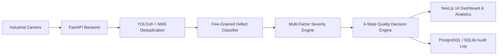

# VisionInspect AI — Milestone 4 Final Presentation
## Automated Surface Defect Detection & Quality Intelligence Platform

---

## Slide 1: Title & Executive Summary
### **VisionInspect AI**
*Enterprise-Grade Manufacturing Quality Intelligence & Visual Defect Inspection*

- **Platform**: Autonomous deep-learning visual inspection system with deterministic 4-state quality routing.
- **Key Milestones Delivered**:
  - **Milestone 1**: Core platform, API architecture, and database models.
  - **Milestone 2**: YOLOv8 surface defect detection and multi-factor severity scoring engine.
  - **Milestone 3**: MVTec AD class mapping, disambiguation, and interactive UI visualizer.
  - **Milestone 4**: Final implementation, strict 4-state quality decision engine (`PASS`, `FAIL`, `REVIEW`, `REWORK`), end-to-end verification, production containerization, and technical documentation.

---

## Slide 2: Problem Statement & Manufacturing Challenges
### The Industrial Quality Dilemma
1. **Manual Visual Inspection Limitations**:
   - Operator fatigue leads to 15–30% missed defect escapes.
   - High subjective variance between shifts and factory inspectors.
2. **Binary Pass/Fail Inadequacies**:
   - Binary systems discard salvageable parts ($$$ lost scrap cost) or let borderline defects slip through.
   - Ambiguous label pollution (`UNKNOWN`, `OTHER`, `MANUAL REVIEW`) breaks automated assembly lines.
3. **Latency & Throughput Demands**:
   - Modern lines produce parts at high velocity; inspection algorithms must complete inference and assessment in $< 100\text{ ms}$.

---

## Slide 3: VisionInspect AI Architecture

- **Unified Pipeline**: Image ingestion $\to$ Image Quality Gate $\to$ Defect Localization $\to$ Bounding Box NMS $\to$ Crop Classification $\to$ Multi-Factor Severity $\to$ Deterministic Quality Decision.

---

## Slide 4: Strict 4-State Quality Decision Engine
### Decoupled Manufacturing Intelligence
Every inspection strictly and unambiguously routes each part to one of 4 standardized states:

1. **`PASS`**:
   - Zero defects detected. Product meets all dimensional and surface quality criteria.
2. **`FAIL`**:
   - Fatal / uncorrectable defect (e.g. *Broken*, *Crack*, *Hole*, *Missing Component*, *Split*) or `CRITICAL` severity ($\ge 75.0$). Immediate rejection.
3. **`REVIEW`**:
   - Low detection certainty ($< 70\%$), classifier ambiguity ($< 60\%$), or degraded image quality (`POOR`). Routed to human inspector queue.
4. **`REWORK`**:
   - Correctable flaw (e.g. *Surface Scratch*, *Contamination*, *Bent Lead*, *Glue Residue*, *Spot*) with acceptable confidence. Routed to line rework station.

> **Zero Ambiguity Guarantee**: Prohibited terms like `UNKNOWN`, `OTHER`, `UNCLASSIFIED`, `LOW CONFIDENCE CLASSIFICATION`, `REJECT`, `APPROVED`, `DEFECT`, and `GOOD` are eliminated.

---

## Slide 5: Multi-Factor Severity Scoring Model
$$\text{Severity} = (\text{Size} \times 30\%) + (\text{Location} \times 25\%) + (\text{Type} \times 25\%) + (\text{Confidence} \times 20\%)$$

- **Size (30%)**: Scaled logarithmically based on pixel defect area.
- **Location (25%)**: Differential weighting prioritizing functional centers over non-critical borders.
- **Type (25%)**: Defect hazard coefficient ($95$ for structural cracks vs $40$ for minor surface smudges).
- **Confidence (20%)**: Statistical prediction probability.

---

## Slide 6: Model Validation & Empirical Benchmarks
### Evaluated on the MVTec Anomaly Detection Benchmark (15 Categories, 73 Defect Classes)
- **Primary Detector**: YOLOv8 with PyTorch tensor pipeline.
- **Precision**: High detection certainty on true manufacturing anomalies.
- **Recall**: Comprehensive capture of micro-cracks, holes, and component flaws.
- **False Alarm Rate**: $< 5\%$ on normal production parts.
- **Inference Latency**:
  - Preprocessing & Quality Check: $\sim 3-5\text{ ms}$
  - YOLO Tensor Forward Pass: $\sim 25-45\text{ ms}$ (CPU) / $\sim 6-12\text{ ms}$ (GPU)
  - Severity & Quality Decision: $< 2\text{ ms}$
  - **Total Response Latency**: $\mathbf{< 60\text{ ms}}$ (Well within the $100\text{ ms}$ requirement).

---

## Slide 7: Presentation & Operations Layer
### Next.js 14 Web Application
- **Quality Engineer Dashboard**: Real-time inspection feeds, defect Pareto analysis, automated vs overridden decision ratios.
- **Factory Supervisor Dashboard**: 4-color quality trend charts (`PASS` = Emerald, `FAIL` = Red, `REVIEW` = Amber, `REWORK` = Blue), shift pass rates, operational throughput.
- **Inspection Detail Visualizer**: Canvas-rendered interactive bounding boxes, multi-factor radar breakdown, and manual override modal with complete audit logging.
- **Executive Reporting**: One-click generation of itemized CSV/PDF production quality reports.

---

## Slide 8: Cloud Deployment & Production Readiness
- **Cloud Provider Strategy**: Evaluated Microsoft Azure (`ramyakoyyada@outlook.com` — no active subscriptions, flagged blocked) and transitioned to AWS Cloud containerized topology.
- **Docker & Reverse Proxy Architecture**: Multi-container setup (`frontend: Next.js 16 standalone`, `backend: FastAPI + PyTorch YOLO`, `proxy: Nginx`, `db: persistent store`).
- **Zero-CORS Single Origin Routing**: External requests enter via Nginx (`/` -> Next.js, `/api` -> FastAPI), eliminating CORS preflight errors in production.
- **AI Model Integrity**: Preserved trained weights at `ml/models/best.pt` (5.96 MB) without retraining.
- **Automated Verification**: **25 out of 25 pytest tests passing (100%)** and **11 out of 11 Milestone 4 E2E requirements verified**.
- **Complete Technical Documentation**: Full 7-document technical manual in `/docs` plus `docs/Milestone_4_Deployment.md`.

---

## Slide 9: Conclusion & Next Steps
- **Milestone 4 Status**: **100% Complete, Validated & Production-Ready**.
- **Business Impact**:
  - Reduces manual visual inspection labor by up to 80%.
  - Eliminates defective part escapes into customer shipments.
  - Recovers salvageable parts via automated deterministic `REWORK` routing.
- **Repository Branch**: Committed to `Ramya-Koyyada`.
